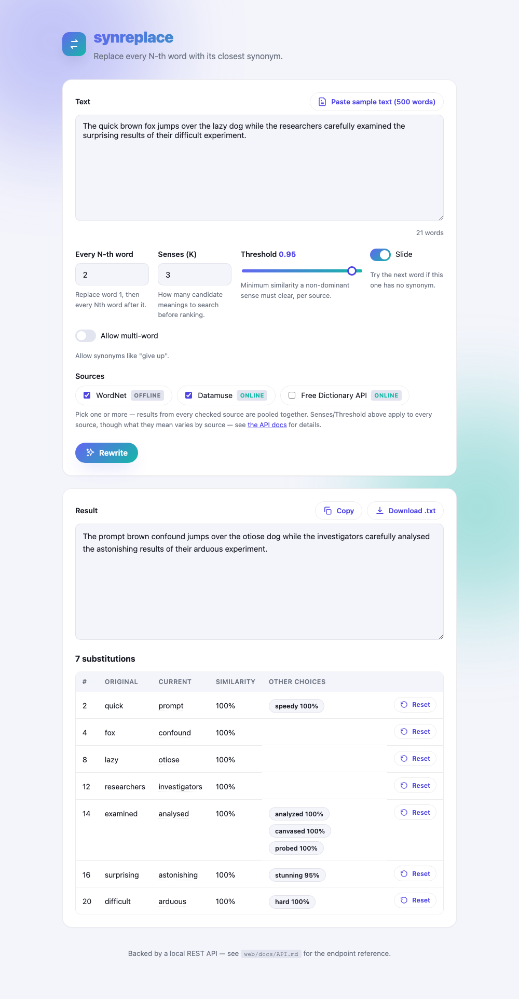

# synreplace


A small CLI that takes a text and gives it back with every N-th word swapped for
its closest synonym. Synonyms come from **WordNet** via NLTK by default — fully
offline, no API key, no network after the first run — with two free, tokenless
online dictionary APIs available as opt-in alternatives (or additions) via
`--sources`; see [below](#synonym-sources).

> Sidenote: also useful to break LLMs' watermarking. But who would want to do such silly thing...

```
$ synreplace -n 3 --slide "The quick brown fox jumps over the lazy dog while the researchers carefully examined the surprising results of their difficult experiment."
The speedy brown fox leaps over the lazy dog while the investigators carefully examined the surprising effects of their hard experiment.
```

## Contents

- [Features](#features)
- [Install](#install)
- [Usage](#usage)
  - [Options](#options)
- [How a synonym is picked](#how-a-synonym-is-picked)
- [`--threshold`: how far a synonym is allowed to drift](#--threshold-how-far-a-synonym-is-allowed-to-drift)
- [Synonym sources](#synonym-sources)
- [What is deliberately left alone](#what-is-deliberately-left-alone)
- [Quality note](#quality-note)
- [Web interface](#web-interface)
- [Project layout](#project-layout)
- [Tests](#tests)

## Features

- **Offline by default.** WordNet via NLTK, downloaded once, no API key, no
  network required afterward.
- **Deterministic.** Same input, same flags, same output — every time, no
  randomness anywhere in the pipeline.
- **Format-preserving.** Whitespace, newlines, punctuation and numbers come
  out byte-identical; only the targeted words change.
- **Grammatically correct substitutions.** A replacement is re-conjugated,
  re-pluralized and re-capitalized to match the original word's form —
  `expressed` → `evinced`, `Researchers` → `Investigators` — and a candidate
  that would need an irregular form nobody can spell reliably (`go` → `goed`)
  is skipped rather than guessed at wrong.
- **Two free online sources, opt-in.** Datamuse and the Free Dictionary API,
  neither needing a key or signup, usable alone or pooled together with
  WordNet — see [Synonym sources](#synonym-sources).
- **Four ways in: CLI, Python library, REST API, browser UI** — all four run
  the same engine underneath, so the same input and flags give the same
  output everywhere.

## Install

```bash
python3 -m venv .venv
source .venv/bin/activate
pip install -e .
```

Requires Python 3.8+.

The WordNet data (~10 MB) downloads itself on the first run, along with the
CMU Pronouncing Dictionary (used for accurate consonant-doubling like "occur"
→ "occurring"; optional -- inflection just falls back to a cruder heuristic
if it can't be fetched).

Also want the [web interface](web/)? Same venv, one more command:

```bash
pip install -r requirements.txt
```

## Usage

```
synreplace [-n N] [--slide] [--senses K] [--threshold T] [--multiword]
           [--sources NAME[,NAME...]] [-v] [-c | -i FILE | -o FILE | TEXT]
```

Input is taken from the first of these that applies:

| Source | How |
| --- | --- |
| Clipboard | `synreplace --clip -n 4` — reads the clipboard, writes the result back to it and prints it |
| File | `synreplace -i draft.txt` — writes `draft-modified.txt` next to it, or `-o FILE` to name it yourself |
| Argument | `synreplace -n 3 "some text here"` — printed to stdout |
| Pipe | `cat draft.md \| synreplace -n 5 > out.md` |
| Interactive | run it bare, paste, then press `Ctrl-D` |

### Options

| Flag | Meaning |
| --- | --- |
| `-n, --every N` | Replace the first word, then every N-th word after it (default `5`) |
| `--slide` | If the N-th word has no synonym, try the next word instead (recommended) |
| `--senses K` | Consider the K closest senses of the word, not just the closest (default `3`) |
| `--threshold T` | Minimum sense similarity (`0`-`1`) a `--senses` candidate must clear (default `0.95`); `0` disables the check — see below |
| `--multiword` | Allow multi-word synonyms such as "give up" |
| `--sources NAME[,NAME...]` | Synonym source(s) to use, comma-separated (default `wordnet`) — see [below](#synonym-sources) |
| `-v, --verbose` | List every substitution on stderr, with its sense similarity |
| `-c, --clip` | Read from and write back to the clipboard |
| `-i, --input` / `-o, --output` | Read from / write to a file. With `-i` alone, output goes to `<name>-modified.<ext>` next to the input file |

Counting starts at the first word: the grid is word 1, then `1 + N`, `1 + 2N`,
and so on — not word `N` itself. Without `--slide`, a missed word is just
skipped — substitutions land only on that fixed grid, so the count is often
well under 1-in-N. With `--slide`, a miss moves the search to the next word
instead, keeping the rate close to 1-in-N (substitutions still stay at least
N words apart).

## How a synonym is picked

1. The whole text is part-of-speech tagged, so "results" the noun and "results"
   the verb are treated differently.
2. The word is reduced to its lemma (`researchers` → `researcher`).
3. WordNet orders a word's senses by how common they are. `--senses 1` uses only
   the most common one; the default, `--senses 3`, also considers its 2nd and
   3rd most common senses, subject to `--threshold` staying on-meaning.
4. Among every candidate gathered across those senses, the one with the
   *highest similarity* to the word's single most common sense wins — not
   whichever sense happens to be listed first. Ties break by corpus frequency,
   then alphabetically, so the tool is fully deterministic.
5. The synonym is put back into the original word's form and capitalisation —
   `expressed` → `evinced`, `Researchers` → `Investigators`.

Nothing else in the text moves: whitespace, newlines, punctuation and numbers
come out byte-identical. `-v` prints each substitution's sense similarity
against the word's dominant meaning (see `--threshold` below) — usually 100%
under the defaults, since a non-dominant sense also has to clear the 95%
threshold to be used at all:

```
  #12 researchers -> investigators (100% similar)
```

## `--threshold`: how far a synonym is allowed to drift

`--senses K` (K > 1) lets a word borrow synonyms from its 2nd, 3rd, ... most
common sense, not just its dominant one — useful for variety, but those senses
can be barely related to what the word actually means in context (`fox` in its
dominant sense is the animal; a rarer sense is "a person who dodges/evades",
giving `dodger`).

`--threshold` guards against that: each candidate sense is scored against the
word's *dominant* sense using WordNet's Wu-Palmer similarity (0-1, based on
how close their nearest common ancestor is in the meaning hierarchy), and any
sense scoring below the threshold is dropped — the word falls through to
skip/slide like it had no synonym at all, the same as any other unusable word.

```
$ synreplace -n 1 --slide --senses 3 --threshold 0 -v "the quick brown fox jumps over the lazy dog"
  #2 quick -> speedy (100% similar)
  #4 fox -> dodger (48% similar)
  #5 jumps -> leaps (100% similar)
  #8 lazy -> indolent (50% similar)
  #9 dog -> frump (60% similar)
5 substitutions

$ synreplace -n 1 --slide --senses 3 --threshold 0.95 -v "the quick brown fox jumps over the lazy dog"
  #2 quick -> speedy (100% similar)
  #5 jumps -> leaps (100% similar)
2 substitutions   # fox, lazy and dog are left alone — their only candidates scored below 95%
```

A word's dominant sense is always 100% similar to itself, so `--threshold`
only ever has something to reject once `--senses` is above `1` — which is the
default (`--senses 3`), so `--threshold` is already doing real filtering work
out of the box. Pass `--senses 1` to turn that off entirely and use only each
word's single most common sense.

## Synonym sources

By default `synreplace` looks synonyms up in WordNet, fully offline. Two free
online dictionary APIs are available too — neither needs an API key or
signup — and `--sources` accepts more than one at once, pooling every enabled
source's candidates into one ranked list rather than picking exactly one:

| Name | What it is | Network? |
| --- | --- | --- |
| `wordnet` | The default described above | No |
| `datamuse` | [Datamuse](https://www.datamuse.com/api/), built specifically for word-relation queries; returns a relevance score per candidate | Yes |
| `dictionaryapi` | [Free Dictionary API](https://dictionaryapi.dev/), a definitions API with synonyms as a secondary field; coverage varies a lot by word | Yes |

```bash
synreplace --sources wordnet,datamuse -v "the quick brown fox jumps over the lazy dog"
```

**`--senses`/`--threshold` apply to every enabled source**, each reinterpreting
them for its own shape of data rather than ignoring them:

- **`wordnet`**: as described above — real, measured semantic distance.
- **`datamuse`**: `--senses` caps how far down Datamuse's own relevance-ranked
  list is searched (its top hit is the "dominant sense" stand-in);
  `--threshold` drops any candidate whose score, normalized against that top
  hit, falls below it. Datamuse doesn't disambiguate word senses at all, so
  even at the default this is a coarser signal than WordNet's — it can still
  occasionally surface a synonym for the wrong meaning of a word (e.g. "fox"
  the animal vs. "to fox someone" meaning to trick them) if a wrong-meaning
  result happens to score close to the top one.
- **`dictionaryapi`**: this API's response is naturally grouped into one
  entry per meaning of the word, in the order it lists them (its own implicit
  "most common first"). `--senses` caps how many of those meaning-entries are
  searched; every candidate from the first one scores 100%, and every
  candidate from a later one scores a flat 50% — not a measured relatedness
  value like WordNet's, since this API doesn't expose anything to actually
  compute one from.

Other trade-offs worth knowing before reaching for the online sources:

- **Speed and reliability.** Each distinct word costs one HTTP request (cached
  per run, so a repeated word is free the second time); a slow or unreachable
  API can add many seconds to a rewrite. A source that fails just contributes
  no candidates rather than erroring out the whole run — a one-time note is
  printed to stderr the first time that happens.
- **Similarity numbers aren't on the same scale across sources.** WordNet's is
  a graph-distance score, Datamuse's is a normalized relevance score, and
  `dictionaryapi`'s is a fixed 100% for every candidate (no ranking data is
  available). All three are shown as 0–100% for consistency, but a Datamuse
  60% and a WordNet 60% don't mean quite the same thing.

## What is deliberately left alone

The tool prefers leaving a word alone over producing a wrong one:

- **Function words and names** — determiners, pronouns, prepositions,
  conjunctions, auxiliaries and proper nouns are never touched.
- **Comparatives and superlatives** (`bigger`, `best`) — their synonyms cannot be
  re-inflected reliably.
- **Irregular forms.** If a candidate synonym inflects irregularly and the
  regular guess would be wrong (`go` → `goed`, `foot` → `foots`), that candidate
  is skipped rather than mangled. WordNet's own exception lists supply this.
- **Words WordNet has no distinct synonym for**, which is a lot of them.

This is why plain `-n 3` often produces fewer substitutions than you would
expect. See `--slide` above for the fix.

## Quality note

None of these sources understand your sentence's context. WordNet picks the
most common sense, which is right most of the time and occasionally not
(`problem` → `job`); the online sources have their own failure modes, noted
under [Synonym sources](#synonym-sources) above. Read the output before using
it; `-v` shows you exactly what changed.

## Web interface

A browser UI and REST API also exist, in [`web/`](web/) — a separate,
self-contained folder with its own setup and its own server, independent of
this CLI. See [`web/README.md`](web/README.md) to run it, and
[`web/docs/API.md`](web/docs/API.md) for the REST API reference.



A few things it adds on top of the CLI:

- **Three ways to view a result**, switched with the Ribbon selector (a nod
  to a typewriter's black/black+red ribbon lever): **Black** shows just the
  plain result; **Blk+Red** marks each change inline, original struck through
  next to its replacement; **Dupl.** shows the original and the result side
  by side, with a proofreader's mark in the gutter next to every changed line.
- **Pick and pool sources visually** — check any combination of WordNet,
  Datamuse and the Free Dictionary API; results are merged live.
- **Reset or swap any correction.** Every card below the result has a Reset
  button back to the original word, plus up to 3 alternative-synonym chips to
  swap in instead — every view updates immediately, no re-run needed.
- **Jump between a word and its card, either way.** Click a card to highlight
  its word in the page; in Blk+Red or Dupl., click a red word to jump back to
  its card. Either one leaves a real inverted-color box in place for 5s.
- **A loading indicator** while a request is in flight (the online sources
  can take a few seconds), and a **?** field guide with a one-line
  explanation of every control.

## Project layout

```
synreplace/    The CLI + library: WordNet lookup, the two online sources,
               inflection, tokenizer, and the rewrite engine every entry
               point (CLI/library/API/UI) shares.
tests/         Tracked test suite (see Tests below).
web/           The browser UI + REST API — a separate app that reuses the
               synreplace engine; see web/README.md.
  backend/     FastAPI app (routes, request/response schemas).
  frontend/    Plain HTML/CSS/JS, no build step.
  docs/API.md  REST API reference.
docs/          Assets for this README (e.g. the screenshot above).
```

## Tests

```bash
python -m unittest discover -s tests -v
```
